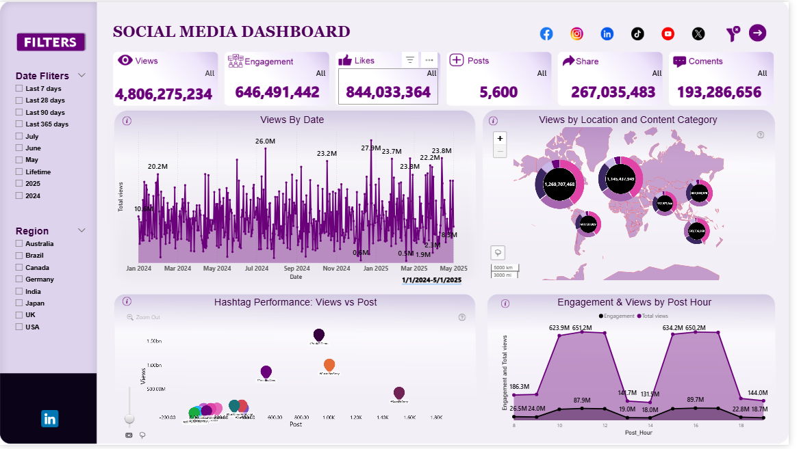

# Social Media Dashboard – Power BI Project

## 📊 Project Overview
This Power BI project analyzes social media metrics across major platforms such as Facebook, Instagram, LinkedIn, and TikTok.

### 📌 Features
- Total Views: 4.8B+
- Engagement, Likes, Shares, Comments, Posts
- Interactive filters by Date and Region
- Hashtag performance analysis
- View distribution by location and post hour

### 📁 Files Included
- `SocialMediaDashboard.pbix`: The main Power BI file
- `dashboard-preview.png`: Screenshot of the final dashboard

### 🧠 Key Learnings
- Data transformation in Power Query
- DAX measures for engagement calculation
- Effective use of filters and visual storytelling

## 🚀 Tools Used
- Power BI
- DAX
- Power Query

## 🔗 Connect with Me
- [LinkedIn](www.linkedin.com/in/abiemwense-obazee-sunday-46a557296)
